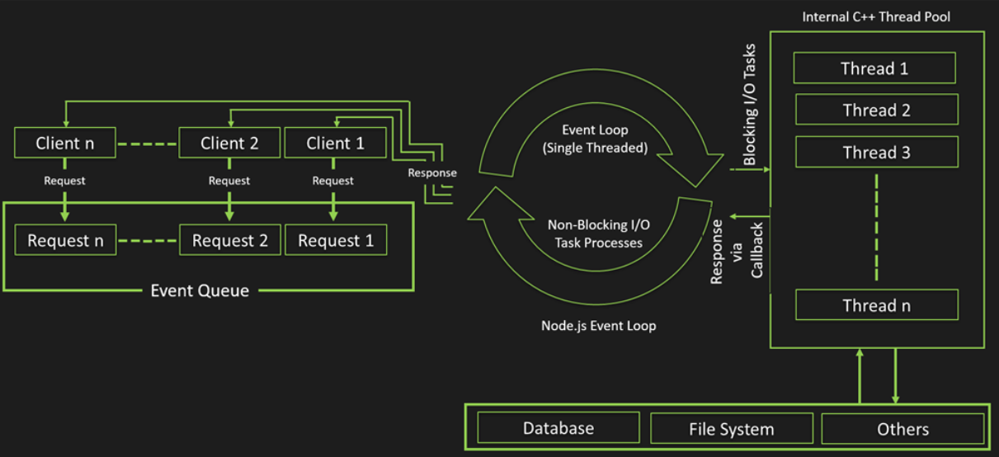

### The Node.js Event Loop 💱
The Event Loop is a core 💫 concept in Node.js that allows it to handle asynchronous 🔀 operations. Node.js is 
single-threaded, which means it executes one task at a time. However, with the event loop, it can handle many I/O-bound operations (like reading files, querying databases, and making HTTP requests) asynchronously without blocking the main thread. This is what makes Node.js highly efficient for building scalable and non-blocking applications.
Let's break down ➡ the event loop in detail:
### 1. Node.js Architecture Overview 📌
Node.js uses an event-driven, non-blocking I/O model that allows it to perform multiple operations concurrently without creating multiple threads. This is made possible by the event loop, which works with:
- **Call Stack: 🗄** A stack where function calls are placed and executed (part of the V8 JavaScript engine).
- **Event Queue (or Task Queue): 🗃** A queue that holds the callback functions for asynchronous operations (e.g., 
  setTimeout, fs.readFile).
- **Event Loop: 💱** The mechanism that continuously checks the call stack and event queue, managing the execution of 
  functions. 
### 2. How the Event Loop Works 🤔

The event loop has a single main thread that repeatedly performs the following steps:
1. Look 🧐 at the Call Stack 🗄:
The event loop checks if the call stack is empty or not.
If it's empty, the event loop checks the event queue 🗃 for pending tasks.
2. Check 🔦 the Event Queue 🗃 :
If there are tasks in the event queue, the event loop takes the first task (callback function) from the queue and pushes it to the call stack to be executed.
3. Execute 🎰 Tasks:
Once tasks are in the call stack, Node.js executes them one by one until the call stack is empty again.
4. Repeat 💫:
This process repeats indefinitely as the event loop continues to check for new tasks in the event queue and handle them asynchronously.
### 3.Phases of the Event Loop
The event loop is divided into phases, each handling a specific type of task. Node.js uses the libuv library to manage the event loop. Here's a breakdown of the phases:
1. Timers Phase:
This phase handles callbacks for setTimeout and setInterval.
If a timer has expired (i.e., the specified delay has passed), its callback function is moved to the call stack for execution.
2. Pending Callbacks Phase:
This phase handles callbacks for certain system operations, such as errors from network operations (e.g., TCP errors).
Idle,
3. Prepare Phase:
This is an internal phase used by Node.js for preparing for upcoming tasks.
4. Poll Phase:
This is one of the most important phases. It processes new I/O events and executes any I/O-related callbacks, like reading from files or databases.
If the event queue is empty in this phase and there are no timers ready to be executed, the event loop will wait here for new I/O events.
5. Check Phase:
This phase handles callbacks for setImmediate functions. These are executed after the poll phase completes.
6. Close Callbacks Phase:
This phase handles cleanup tasks, like closing sockets or other resources (e.g., close events from net or http servers).
### 4. Synchronous vs. Asynchronous Code in the Event Loop
**Synchronous Code:**
Blocking: Synchronous code is executed directly on the call stack 🗄 (First in Last Out). Each task must complete 
before the next one can start, meaning the thread is blocked until the operation finishes.
**Asynchronous Code:**
Non-blocking: Asynchronous operations (e.g., reading from a file, network requests) are handled outside the call 
stack. When the operation completes, the callback is placed in the event queue 🗃 (First in Last Out), waiting to be 
added to the call stack.
### 5.Understanding setTimeout and setImmediate in the Event Loop
**setTimeout**
It schedules a callback after a minimum delay (e.g., setTimeout(() => {}, 0) still waits for the poll phase to complete).
**setImmediate**
It schedules a callback to run immediately after the poll phase completes, but before any timers.
**E.x**
```javascript
setTimeout(() => {
  console.log('Timeout');  // Runs after I/O and the event loop cycles
}, 0);

setImmediate(() => {
  console.log('Immediate'); // Runs after the poll phase
  //Output
  Immediate
  Timeout
});
```
>*Note📌:* This behavior shows that setImmediate is executed first because it runs in the check phase (after poll), 
> whereas setTimeout runs in the timers phase, which comes later.
### 6. Handling I/O Operations in the Event Loop
I/O-bound tasks are very common in Node.js applications, such as reading from or writing to files, making network requests, or querying databases. These tasks are asynchronous and handled via the event loop, allowing Node.js to keep the main thread free.
### 7. Event Loop in Action: Example
Here’s a more complex example to show how the event loop handles different tasks:
Try to suggest the Correct Output 🤔 
```javascript
console.log('Start');

setTimeout(() => {
  console.log('Timeout');
}, 0);

setImmediate(() => {
  console.log('Immediate');
});

fs.readFile(__filename, () => {
  console.log('File read completed');
});

console.log('End');
```

